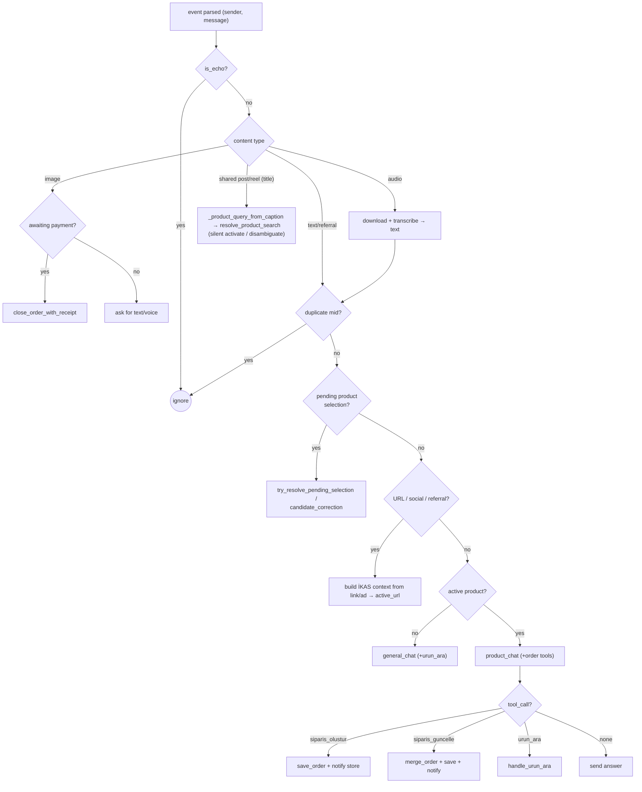
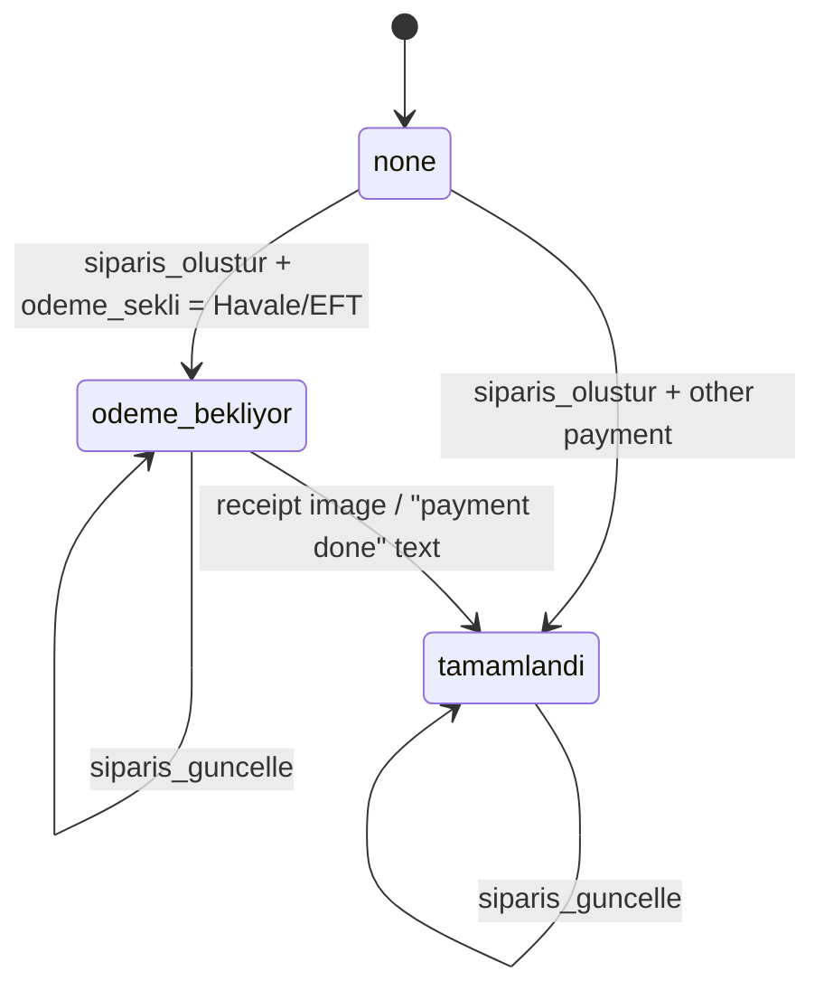

# AI sales agent & commerce flow

**Responsibility:** how the bot decides what to say and do — prompt assembly,
OpenAI tool-calling, İKAS product search/matching, the order state machine, and
chat-session/dedup mechanics. Covers the branching logic *inside*
`_process_instagram_webhook` after the tenant scope is set.

**Source of truth:** `main.py` (the webhook handler + its helpers),
`Services/openai_service.py`, `ikas_service.py`, `order_service.py`,
`session_store.py`, `session_service.py`, `message_service.py`. Prompt text:
`sales_prompt.txt`, `siparis_ozellik_promptu.md`, `general_prompt.txt`.

> Upstream of this doc: signature verify + tenant routing
> ([meta-integration](./meta-integration.md), [multi-tenancy](./multi-tenancy.md)).

---

## Prompt assembly

`main.py:build_system_prompt()` builds the sales system prompt at **request
time** (so per-tenant values are fresh):

```
sales_prompt.txt  (+ {IBAN_BILGISI} replaced with the tenant's store IBAN)
  + "\n\n" + siparis_ozellik_promptu.md   (order-field rules)
```

`general_prompt.txt` is the lighter prompt used when there is no active product
context. `reload_system_prompt()` refreshes the cached copy after a panel
setting change. **To change the bot's tone or rules, edit the prompt files —
not Python.**

---

## Two chat entry points + three tools

`Services/openai_service.py` builds a per-tenant `OpenAI` client (keyed by
`current_tenant_id`, lazily cached; `invalidate_client()` on key change) and
exposes:

- `general_chat(general_prompt, message_text, sender)` — no product context;
  offered only the `urun_ara` tool.
- `product_chat(system_prompt, products_block, history, message_text, sender, …)`
  — full context; tool set depends on order state (below).

Both funnel through `_create_chat`, which calls
`chat.completions.create(..., tool_choice="auto", max_tokens=MAX_OUTPUT_TOKENS)`,
parses the **first** tool call, and logs cost/latency (see §Cost logging).

| Tool | Defined in | Model calls it to… | Offered when |
|---|---|---|---|
| `urun_ara` | `ikas_service.URUN_ARA_TOOL` | search the catalog by product **name** | always |
| `siparis_olustur` | `order_service.SIPARIS_TOOL` | create an order (only after explicit customer confirmation) | `order_state is None` |
| `siparis_guncelle` | `order_service.SIPARIS_GUNCELLE_TOOL` | amend an existing order | `order_state is not None` |

The handler dispatches on `response["tool_call"]["name"]`; a plain `answer` is
sent as-is (with a friendly fallback if empty).

---

## Message decision flow

The DM handler (`_process_instagram_webhook`) is a priority ladder. Simplified:



Key helpers in `main.py`: `extract_url` / `slug_to_query` /
`is_social_media_url` (link → catalog query), `build_referral_search_text`
(Instagram **ad**/referral → search text — the main Instagram entry point is a
customer *sharing a product post*, so caption/referral parsing matters more than
on WhatsApp), `try_resolve_pending_selection` &
`try_resolve_candidate_correction` (interpreting "the 2nd one" / corrections
against a candidate list), and `refresh_transient_state` (reset volatile state on
a fresh greeting or after `LONG_SESSION_MESSAGE_LIMIT` messages).

---

## Order state machine

`session["order_state"]` drives which order tool is offered and how receipts are
handled:



- While `order_state is None`, `siparis_olustur` is offered; once an order
  exists, it is swapped for `siparis_guncelle` so the customer can amend
  address/product/colour/size/quantity/payment.
- `Havale/EFT` (bank transfer) → `odeme_bekliyor` (await receipt); an uploaded
  image or a "payment done" phrase (`looks_like_payment_done`) triggers
  `close_order_with_receipt`. Other payment methods → `tamamlandi` immediately.
- `order_service.save_order` appends a row (updates use `is_update=1`);
  `merge_order` fills unchanged fields from the previous order;
  `format_order_message` builds the WhatsApp store notification; `build_order_block`
  feeds the current order back to the model as context on updates.

---

## İKAS product catalog

`Services/ikas_service.py` (per-tenant, credential-keyed cache). Talks to İKAS
via OAuth token + GraphQL. The search path is name-based and fuzzy because
customers rarely send exact SKUs:

- `resolve_product_search(name)` → `{status: found|multiple|not_found, …}`.
  `found` → single product; `multiple` → candidate list the handler asks the
  customer to pick from (stored in `session["pending_products"]`).
- Matching is normalized (`_normalize_tr`), word-scored (`_score_match`), and
  de-duplicated by base name (colour-suffix stripped) so variants collapse.
- `build_ikas_ai_context(product)` renders the product (price, stock,
  variant types like colour/size) into the compact text block the model sees.
- `get_cached_ikas_context` / `..._by_id` add a short TTL cache;
  `session_service.build_products_block` assembles the "Ürün Bilgileri" block
  injected into `product_chat`.

---

## Sessions & deduplication

- `Services/session_store.py`: chat session state lives in **Redis** (key
  `ia:session:{tenant}:{igsid}`, TTL `SESSION_TIMEOUT` — note: README/`config.py`
  comments say `ig:session:`, but the code constant `KEY_PREFIX` is authoritative)
  so the app is stateless/scalable;
  `InMemorySessionStore` is the single-instance fallback. `SessionRegistry`
  (a `MutableMapping`) preserves the old `chat_sessions[sender]` dict API on top
  of the store. `new_session()` defines the session shape (history,
  active_url, pending_products, order_state, message_count, …).
- History sent to the model is capped at `MAX_HISTORY` messages.
- `Services/message_service.py`: `is_duplicate(mid)` guards against Meta's
  repeated deliveries, **tenant-namespaced** (`{tenant}:{mid}`) in Redis with an
  in-process fallback — so the same message id under different tenants is not
  confused.

---

## Cost logging

Every model call is logged by `_create_chat` → `usage_logger.log_usage` into
`usage_logs` (tenant-scoped): tokens, cost, latency, model. Cost math accounts
for OpenAI **prompt caching** — cached prompt-prefix tokens are billed at
`CACHED_INPUT_DISCOUNT` (50%), so the panel's cost matches the real invoice
rather than over-reporting. Pricing constants live in `config.py`
(`INPUT_TOKEN_PRICE`, `OUTPUT_TOKEN_PRICE`, `MAX_OUTPUT_TOKENS`). The panel reads
this data via `dashboard_service` (see [architecture](./architecture.md)).
