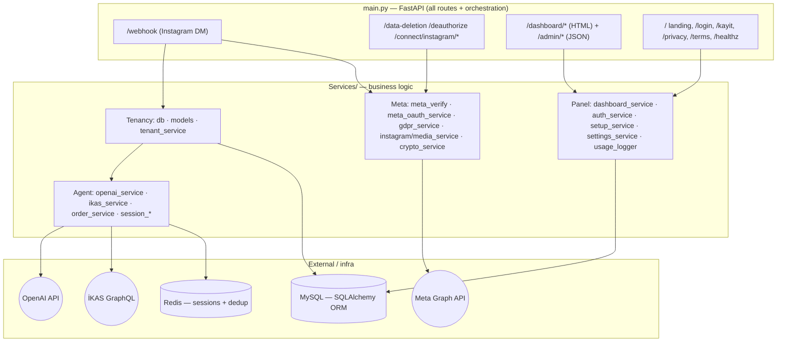
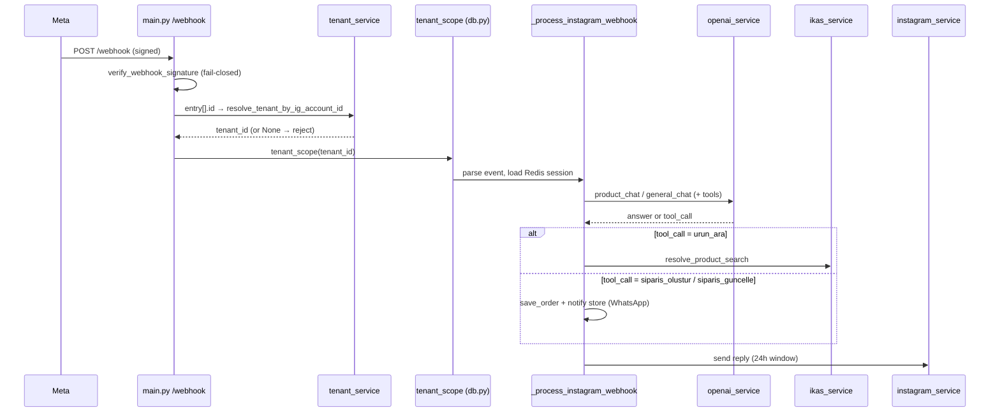
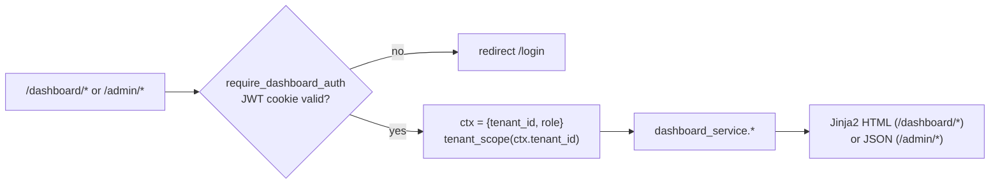

# Architecture — the map

**Responsibility:** breadth only. Where every subsystem lives, how the two
request lifecycles run, and which deep-dive doc to open next. This file is a
router; it does not re-explain what the deep-dive docs cover.

> Deep dives: [multi-tenancy](./multi-tenancy.md) ·
> [ai-and-commerce](./ai-and-commerce.md) · [meta-integration](./meta-integration.md)

---

## Layers

Everything enters through `main.py`. `config.py` sits beside it and resolves
config in the order **DB setting (`settings` table) → `.env` → code default**
via accessor functions (`config.ig_access_token()`, `config.store_iban()`, …);
integration services call these accessors, never the raw module constants, so a
panel setting change takes effect without a restart.

---

## Where things live (open only what the task needs)

| Concern | File(s) | Open when |
|---|---|---|
| Routes + DM pipeline | `main.py` | Any route or the message flow |
| Config & credentials | `config.py`, `.env.example` | Adding/reading a setting |
| Tenant isolation core | `Services/db.py`, `models.py`, `tenant_service.py` | See [multi-tenancy](./multi-tenancy.md) |
| AI chat + tools | `Services/openai_service.py` | See [ai-and-commerce](./ai-and-commerce.md) |
| Product catalog | `Services/ikas_service.py` | Product search/matching |
| Orders | `Services/order_service.py` | Order tools, save/merge/format |
| Chat sessions | `Services/session_store.py`, `session_service.py`, `message_service.py` | Session state / dedup |
| Meta send/verify/OAuth/GDPR | `Services/meta_verify.py`, `meta_oauth_service.py`, `gdpr_service.py`, `instagram_service.py`, `media_service.py` | See [meta-integration](./meta-integration.md) |
| Secret encryption | `Services/crypto_service.py` | Tenant secret read/write |
| Panel data & reports | `Services/dashboard_service.py` | Dashboard/reports/exports |
| Auth (panel login) | `Services/auth_service.py`, `user_service.py` | See §Panel & Auth |
| Setup wizard backend | `Services/setup_service.py`, `settings_service.py` | Onboarding/setup screens |
| Tenant lifecycle | `Services/onboarding_service.py`, `tenant_service.py` | Creating tenants |
| Cost logging | `Services/usage_logger.py` | AI usage/billing data |
| Schema migration | `migrations/run.py` | DDL / backfill |

`dashboard_service.py` and `setup_service.py` are large but flat — each function
is self-contained. Grep for the function; never read either end-to-end.

---

## Lifecycle 1 — Instagram DM (the core path)

Signature verify and tenant routing are covered in
[meta-integration](./meta-integration.md) and [multi-tenancy](./multi-tenancy.md);
the branching logic after `tenant_scope` (URL vs referral vs shared post vs
pending selection vs order state) is covered in
[ai-and-commerce](./ai-and-commerce.md). This diagram is only the skeleton.

---

## Lifecycle 2 — Panel request

`/dashboard/*` return rendered HTML pages; `/admin/*` return the JSON/CSV the
page's JS (`static/js/*.js`) fetches. They pair up (e.g. `/dashboard/customers`
+ `/admin/customers`). A first-run **setup gate** middleware (`_setup_gate` in
`main.py`) redirects to `/dashboard/settings/setup` until setup is complete.

---

## Panel & Auth (small enough to summarize here)

- **Auth model** (`Services/auth_service.py`): email + password → bcrypt check →
  JWT in an HTTP-only cookie. The token payload (`ctx`) carries `tenant_id` and
  `role`. Roles: `owner`, `member`, `superadmin` (platform operator).
  `require_dashboard_auth` is the FastAPI dependency guarding panel routes;
  `require_superadmin` / `require_platform_operator` gate platform routes
  (`/admin/platform/*`).
- **Panel credentials are tenant-owned.** The login email + bcrypt hash live in
  the `users` table, one owner row per tenant, written by the setup wizard's
  *Gelişmiş* section (`PANEL_EMAIL` / `PANEL_PASSWORD`, `target="account"`) via
  `user_service.upsert_tenant_owner`. They must **never** go back into `.env`:
  it is a single shared file, so a second tenant completing setup would
  overwrite the first tenant's login. Tests: `tests/test_panel_account.py`.
- **Legacy bootstrap fallback:** if no DB `User` matches, login falls back to
  `.env` `DASHBOARD_USER` + `DASHBOARD_PASSWORD_HASH` and assumes
  `DEFAULT_TENANT_ID = 1`. This exists only to get into a fresh install; delete
  those two keys from `.env` once a real user exists. Fail-closed: with neither
  a DB user nor a configured hash, the panel is locked.
- **Setup wizard** (`Services/setup_service.py`): section-based
  (Instagram/OpenAI/İKAS/notifications) with per-section "Test" calls to the live
  APIs before "Complete". Each field declares a `target`: `setting` → `settings`
  table (secrets encrypted), `account` → `users` table (panel login),
  `env` → patches `.env` in place (platform-level only), `readonly` → displayed
  but not writable. See [meta-integration](./meta-integration.md) for how
  connect/credentials feed this.
- **Reporting** (`Services/dashboard_service.py`): business/usage/performance
  summaries, conversation & customer lists with pagination, AI-usage detail, and
  CSV exports. Reads only; all queries run inside the active `tenant_scope`.

---

## Tests as executable documentation

`tests/` (pytest + SQLite) is the fastest way to confirm intended behaviour of
the risky parts. Notable files: `test_isolation_orm.py`, `test_idor.py`,
`test_session_isolation.py`, `test_ai_usage_isolation.py`,
`test_leads_access.py` (tenancy); `test_webhook_signature.py`,
`test_webhook_routing.py`, `test_oauth_state.py`, `test_deauthorize.py`,
`test_data_deletion.py` (Meta/compliance); `test_auth.py`,
`test_settings_secrets.py`, `test_onboarding.py`, `test_migration.py`,
`test_cache_invalidation.py`. Run: `python -m pytest tests/` (uses SQLite via
`DATABASE_URL`, no MySQL/Redis needed — see `tests/conftest.py`).
