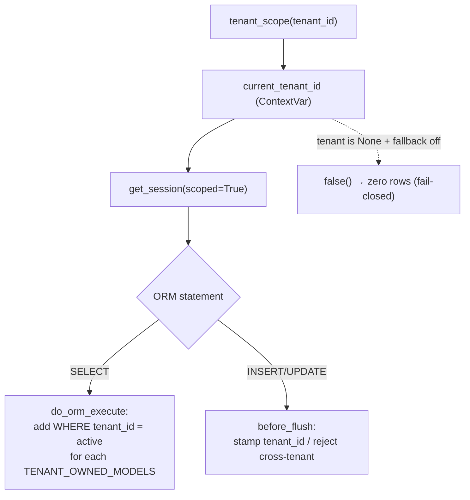
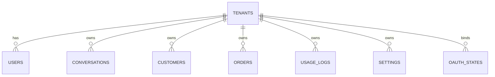

# Multi-tenancy & data model

**Responsibility:** how tenant isolation is enforced, the DB schema, and the
rules for touching either without leaking data across tenants. This is the
highest-risk subsystem — read it before any change that queries, writes, or
routes tenant data.

**Source of truth:** `Services/db.py`, `Services/models.py`,
`Services/tenant_service.py`. Tests that lock the behaviour:
`tests/test_isolation_orm.py`, `test_idor.py`, `test_session_isolation.py`,
`test_ai_usage_isolation.py`, `test_leads_access.py`.

---

## The core idea

Isolation is **not** written per query. Developers never hand-write
`WHERE tenant_id = ?`. Instead it is enforced **once**, centrally, at the
SQLAlchemy session layer, and it is **fail-closed**: if the active tenant is
unknown, tenant-owned rows are invisible rather than global.

Two mechanisms in `Services/db.py`:

| Event | Trigger | Effect |
|---|---|---|
| `do_orm_execute` | every ORM **SELECT** on a scoped session | auto-appends `tenant_id = <active>` for each model in `TENANT_OWNED_MODELS` |
| `before_flush` | every **INSERT/UPDATE** on a scoped session | stamps `tenant_id` on new rows; rejects cross-tenant insert/update (`TenantScopeError`) |

The active tenant is held in a `contextvars.ContextVar` (`current_tenant_id`),
so concurrent webhook requests never see each other's tenant.

Two subtleties worth preserving:

- The SELECT filter is applied as a **direct expression** (`model.tenant_id == tid`),
  *not* a lambda. A lambda-based `with_loader_criteria` can cache the compiled
  query and reuse it with a different `tenant_id` — a real isolation hole. Keep
  it a direct expression.
- The filter is applied over an **allowlist** (`TENANT_OWNED_MODELS`), not by
  scanning tables. A model missing from the list is simply not filtered — i.e.
  it **leaks**. The isolation tests exist to catch exactly that omission.

---

## `scoped=True` vs `scoped=False`

`get_session()` defaults to `scoped=True` (filtered + stamped). `scoped=False`
is a **deliberate, audited** cross-tenant escape hatch, used only for genuine
system work that must see across tenants:

- login / user lookup by email (`user_service`, `auth_service`)
- webhook → tenant resolution (`tenant_service`)
- onboarding / tenant creation (`onboarding_service`)
- data-deletion & deauthorize (must purge a customer from *all* tenants — see
  [meta-integration](./meta-integration.md))
- migrations (`migrations/run.py`)

> **Rule:** do not add a new `scoped=False` caller without a clear cross-tenant
> justification. Every new one is a potential leak and should have a test.

---

## Webhook → tenant routing (fail-closed)

The canonical tenant key for an inbound Instagram event is the **receiving
business account**: `entry[0].id` (equal to `recipient.id`), i.e. the Instagram
Business Account ID. The customer's `sender.id` (IGSID) is **not** a tenant key.

`Services/tenant_service.py`:
`extract_ig_account_id(body)` → `resolve_tenant_by_ig_account_id(id)` →
`tenant_id` or `None`. Unknown/inactive accounts return `None`, and `main.py`
**rejects** the webhook — an unknown account never falls through to the default
tenant. Resolution is cached in-process (300 s TTL); `invalidate()` is called
when a tenant's account mapping changes. `main.py` then wraps processing in
`tenant_scope(tenant_id)`.

---

## Data model

`Services/models.py`. All models derive from `Base`. Tenant-owned models
additionally carry the `TenantScoped` **marker** (a bare marker class — the
`tenant_id` column is declared on each model, so composite-PK tables can put
`tenant_id` in the primary key).

| Model / table | Scope | Key / notes |
|---|---|---|
| `Tenant` / `tenants` | **global** (root) | `ig_account_id` UNIQUE — the webhook routing key. `plan` reserved for billing (Faz 12, not implemented). |
| `User` / `users` | **global** (root) | email UNIQUE platform-wide (login must find users without a tenant context); `role` ∈ owner/member/superadmin; `tenant_id` FK derives the tenant — never trust a request-supplied tenant. |
| `OAuthState` / `oauth_states` | **global** (root) | single-use CSRF state binding an OAuth flow to a tenant/user; consumed & deleted in the callback. |
| `SignupRequest` / `signup_requests` | **global** (root) | landing-page leads; a platform operator converts one into a tenant. |
| `UsageLog` / `usage_logs` | **tenant** | LLM cost/latency per request. |
| `Conversation` / `conversations` | **tenant** | inbound/outbound DM log; `direction` ∈ gelen/giden. |
| `Customer` / `customers` | **tenant** | **composite PK `(tenant_id, phone)`** — same IGSID may exist under different tenants. |
| `Setting` / `settings` | **tenant** | **composite PK `(tenant_id, skey)`**; key-value config; secret values Fernet-encrypted in `svalue` (see [meta-integration](./meta-integration.md)). |
| `Order` / `orders` | **tenant** | updates are appended as new rows with `is_update=1`. |

Root models (`Tenant`, `User`, `OAuthState`, `SignupRequest`) are **not**
`TenantScoped` on purpose: login and routing must reach them without a tenant
filter. `DEFAULT_TENANT_ID = 1` is the original single-tenant ("Mumi") store,
used by the backward-compat fallback and backfill.

---

## Adding a new tenant-owned table (checklist)

1. Define the model in `models.py` deriving from `Base, TenantScoped`, with its
   own `tenant_id` column (plain indexed column, or part of a composite PK).
2. **Add it to `TENANT_OWNED_MODELS`** — omission = silent cross-tenant leak.
3. Add creation/backfill to `migrations/run.py` (additive, idempotent; see the
   phased step order documented at the top of that file).
4. Add an isolation test mirroring `tests/test_isolation_orm.py`.
5. If any field is a secret, encrypt via `settings_service`/`crypto_service` —
   do not add a new plaintext secret column.

---

## Config resolution (per tenant)

`config.py` exposes accessor functions used by integration services:
`get_setting(key)` reads the `settings` table first (via `settings_service`,
lazily to avoid an import cycle), then falls back to `.env` / a code default.

- **Tenant-scoped** (per store, editable in the panel): İKAS creds, IG account
  id/token/api-base, store IBAN, WhatsApp notify number.
- **Platform-level** (shared, `.env` only, never in `settings`): `OPENAI_API_KEY`,
  `MODEL_NAME`, `META_APP_ID/SECRET/REDIRECT_URI`, `ENCRYPTION_KEY`, `JWT_SECRET`.
  OpenAI cost is borne centrally, so tenants are not asked for an OpenAI key.
